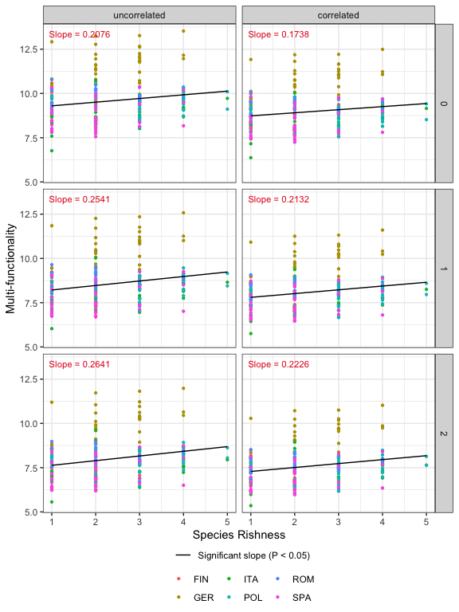
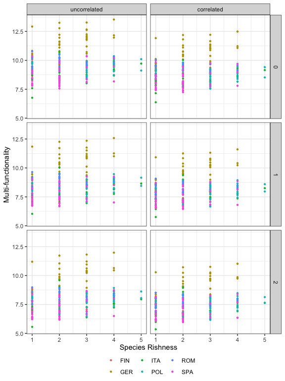
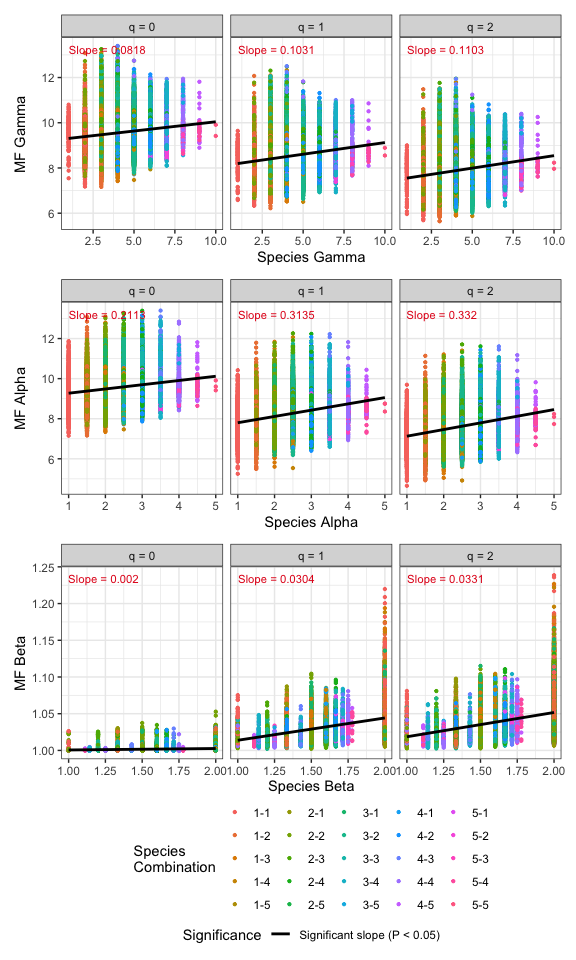
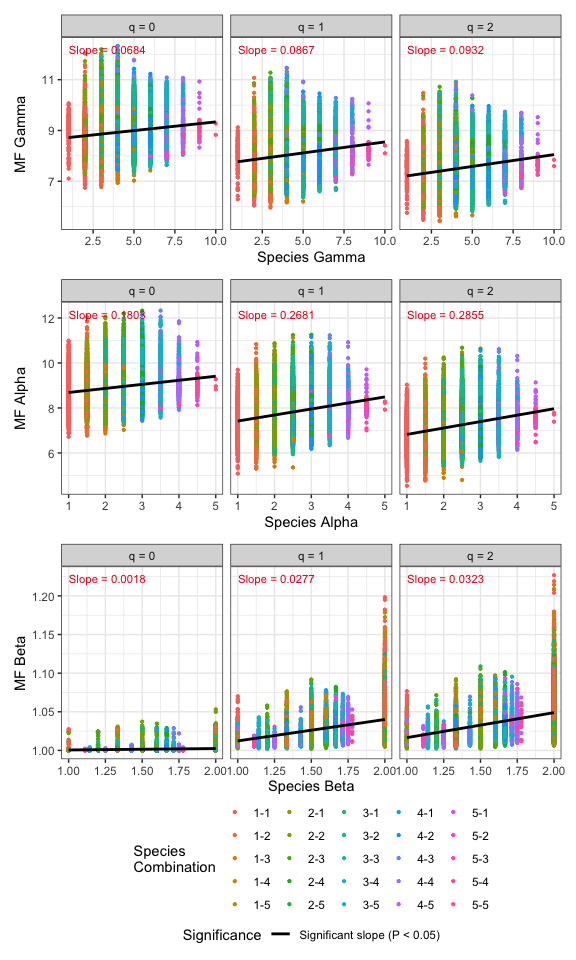
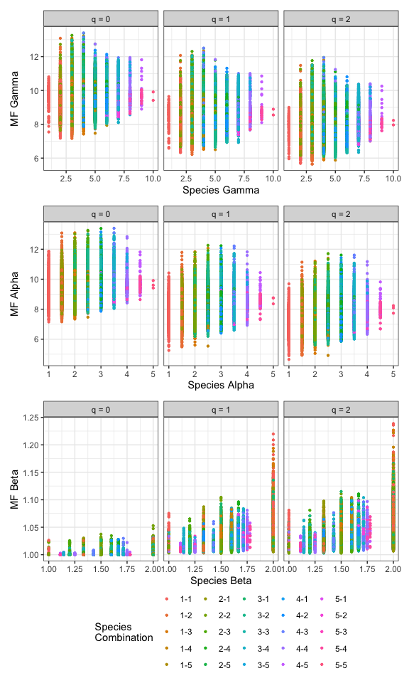
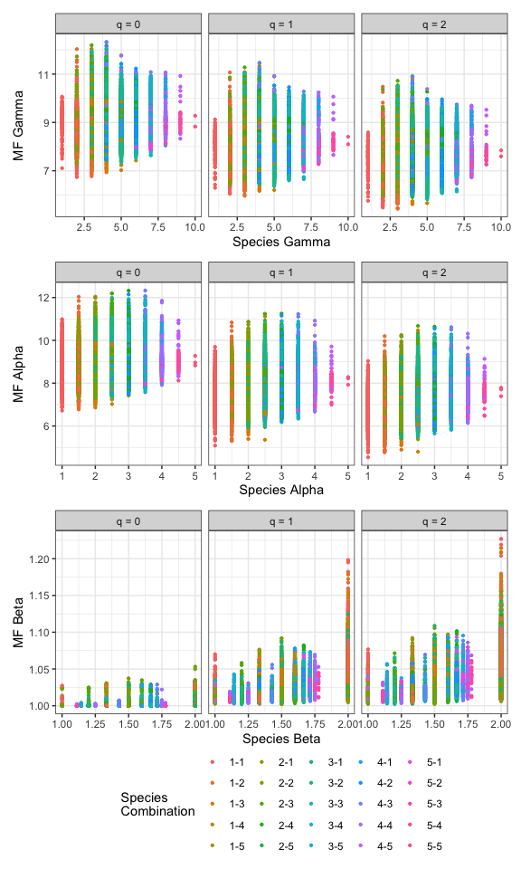

<!-- README.md is generated from README.Rmd. Please edit that file -->

## SOFTWARE NEEDED TO RUN MF IN R

- Required: [R](https://cran.r-project.org/)
- Suggested: [RStudio
  IDE](https://www.rstudio.com/products/RStudio/#Desktop)

## HOW TO RUN MF:

Here are four main functions we provide in this package :

- **MF_measures** : Computing quantification or decomposition of
  multi-fuctionality measures when all functions are assumed to be
  independent, or when the correlation between any two functions is
  adjusted for. In the latter case, our MF value is obtained based on an
  integrated measure by considering all possible threshold levels.
- **ggmf** : Visualizing the output from the function `MF_measures`

## Multi-functionality: MF_measures()

We first describe the main function `MF_measures()` with default
arguments:

``` r
MF_measures <- function(data, q = c(0,1,2), fun_cols = 1:ncol(data),
                        ecosystem = "single", species_col = NULL,
                        is_normalized = TRUE, negative = NULL, is_zero_miss = TRUE)
```

The arguments of this function are briefly described below, and will be
explained in more details by illustrative examples in later text. This
main function computes quantification or decomposition
multi-fuctionality of order q when all functions are assumed to be
independent or when the correlation is considered.

<table style="width:100%;">
<colgroup>
<col width="20%">
<col width="80%">
</colgroup>
<thead>
<tr class="header">
<th align="center">
Argument
</th>
<th align="left">
Description
</th>
</tr>
</thead>
<tbody>
<tr class="odd">
<td align="center">
<code>data</code>
</td>
<td align="left">

1)  For <code>is_normalized = TRUE</code>, data can be input as a vector
    of functions (for a single assemblage),
    <code>matrix/data.frame</code> (assemblages by functions). In this
    case, the data input must be normalized between 0 and 1 already.
2)  For <code>is_normalized = FALSE</code>, data can only be input as a
    matrix/data.frame (multiple assemblages by functions).
    </td>

</tr>
<tr class="even">
<td align="center">
<code>q</code>
</td>
<td align="left">
a numerical vector specifying the diversity orders. Default is 0, 1 and
2..
</td>
</tr>
<tr class="odd">
<td align="center">
<code>fun_cols</code>
</td>
<td align="left">
the order number of the columns which be used as the function variable..
</td>
</tr>
<tr class="even">
<td align="center">
<code>ecosystem</code>
</td>
<td align="left">
<code>‘single’</code> or <code>‘multiple’</code>. Determine MF measures
in a single ecosystem or multiple ecosystems.
</td>
</tr>
<tr class="odd">
<td align="center">
<code>species_col</code>
</td>
<td align="left">
(required only when <code>ecosystem = ‘multiple’</code>), name of the
column to be used to calculate the species diversity.
</td>
</tr>
<tr class="even">
<td align="center">
<code>is_normalized</code>
</td>
<td align="left">
a logical variable to represent whether the data input is normalized
between 0 and 1, default is <code>TRUE</code>.
</td>
</tr>
<tr class="odd">
<td align="center">
<code>negative</code>
</td>
<td align="left">
(required only when <code>is_normalized = FALSE</code>), name of columns
to be normalized negatively.
</td>
</tr>
<tr class="even">
<td align="center">
<code>is_zero_miss</code>
</td>
<td align="left">
(required only when <code>is_normalized = FALSE</code>), a logical
variable to determine whether the zero in data represents no value or
not, default is <code>TRUE</code>.
</td>
</tbody>
</table>

This function returns an `"mf"` object which can be further used to make
plots using the function `ggmf()` to be described below.

### Example Data

A forest tree species and ecosystem function data is included in `MF`
package for illustration. In the data, a total of 209 plots were
established in mature forests in six countries, representing six major
European forest types: boreal forest (Finland); hemi-boreal (Poland);
temperate deciduous (Germany); mountainous deciduous (Romania);
thermophilous deciduous (Italy); and Mediterranean mixed (Spain). In
each country, three to five common tree species were selected for the
species pool; species richness in 209 plots consisted of one to five
species sampled from the species pool. A total of 26 ecosystem functions
or properties were measured in each plot.

For this data, the following commands display how to compute
multi-functionality and corresponding decomposition in multiple
ecosystems .

Run the following code to view normalized forest data: (Here we only
show the first ten rows of the first two ecosystem functions)

``` r
data("Europe_Forest")
Europe_Forest
```

    #>    plotid target_species_richness composition earthworm_biomass
    #> 1   FIN01                       2   Piab.Pisy                NA
    #> 2   FIN02                       2     Be.Piab             0.008
    #> 3   FIN03                       2     Be.Piab             0.011
    #> 4   FIN04                       2     Be.Piab                NA
    #> 5   FIN05                       2     Be.Pisy             0.016
    #> 6   FIN06                       1        Piab                NA
    #> 7   FIN07                       1          Be             0.855
    #> 8   FIN08                       1          Be             0.482
    #> 9   FIN09                       1        Pisy             0.004
    #> 10  FIN10                       1        Piab                NA
    #>    fine_woody_debris
    #> 1              0.453
    #> 2              0.286
    #> 3              0.206
    #> 4              0.209
    #> 5              0.088
    #> 6              0.190
    #> 7              0.104
    #> 8              0.088
    #> 9              0.162
    #> 10             0.357

### Computing Multi-functionality Via Example

#### When data is already normalized.

For example, given a normalized data, we run the `mf()` function without
setting `negative` and `is_zero_miss` to compute uncorrelated and
correlated multi-functionality. (Here we only show the first six
outputs)

``` r
data("Europe_Forest")
output1 <- MF_measures(data = Europe_Forest, fun_cols = 4:29, ecosystem = 'single')
output1
```

    #> # A tibble: 6 × 7
    #>   plotid target_species_richness composition Country Type         Order.q   qMF
    #>   <chr>                    <int> <chr>       <fct>   <fct>        <chr>   <dbl>
    #> 1 FIN01                        2 Piab.Pisy   FIN     uncorrelated 0        9.71
    #> 2 FIN01                        2 Piab.Pisy   FIN     uncorrelated 1        8.78
    #> 3 FIN01                        2 Piab.Pisy   FIN     uncorrelated 2        8.24
    #> 4 FIN01                        2 Piab.Pisy   FIN     correlated   0        9.18
    #> 5 FIN01                        2 Piab.Pisy   FIN     correlated   1        8.40
    #> 6 FIN01                        2 Piab.Pisy   FIN     correlated   2        7.93

The output contains ID of plot (`plotid`), species richness
(`target_species_richness`), composition of species (`composition`),
country which the plot belong to (`Country`), `Type` (uncorrelated or
correlated), the diversity order (`Order.q`) and multi-functionality
(`qMF`).

#### When data is not normalized.

Given a raw data, we run the `mf()` function with setting `negative`,
names of functions with smaller value as better, and `is_zero_miss` to
compute uncorrelated and correlated multi-functionality.

``` r
data("Europe_Forest_raw")
output2 = MF_measures(data = Europe_Forest_raw, fun_cols = 4:29, ecosystem = 'single',
                      is_normalized = FALSE, negative = c("soil_cn_ff_10","wue"), is_zero_miss = TRUE)
output2
```

### Computing Decomposition of Multi-functionality In Multiple Ecosystems Via Example

For example, we run the `MF_measures()` function with forest data to
compute uncorrelated and correlated multi-functionality relationships
across spatial scales. (Here we only show the first six outputs)

``` r
data("Europe_Forest")
output3 = MF_measures(data = Europe_Forest, fun_cols = 4:29,
                      ecosystem = 'multiple', species_col = "composition")
output3
```

    #>        plotid target_species_richness       composition Country Order MF_gamma
    #> 1 FIN01-FIN02                     2-2 Piab.Pisy-Be.Piab     1-1 q = 0    9.156
    #> 2 FIN01-FIN02                     2-2 Piab.Pisy-Be.Piab     1-1 q = 1    8.318
    #> 3 FIN01-FIN02                     2-2 Piab.Pisy-Be.Piab     1-1 q = 2    7.764
    #> 4 FIN01-FIN03                     2-2 Piab.Pisy-Be.Piab     1-1 q = 0    8.950
    #> 5 FIN01-FIN03                     2-2 Piab.Pisy-Be.Piab     1-1 q = 1    8.064
    #> 6 FIN01-FIN03                     2-2 Piab.Pisy-Be.Piab     1-1 q = 2    7.490
    #>   MF_alpha
    #> 1    9.154
    #> 2    8.106
    #> 3    7.472
    #> 4    8.718
    #> 5    7.656
    #> 6    7.057

    #>   MF_beta Species_gamma Species_alpha Species_beta MF_gamma_cor MF_alpha_cor
    #> 1   1.000             3             2          1.5        8.614        8.612
    #> 2   1.026             3             2          1.5        7.905        7.717
    #> 3   1.039             3             2          1.5        7.427        7.163
    #> 4   1.027             3             2          1.5        8.434        8.212
    #> 5   1.053             3             2          1.5        7.685        7.319
    #> 6   1.061             3             2          1.5        7.188        6.795
    #>   MF_beta_cor
    #> 1       1.000
    #> 2       1.024
    #> 3       1.036
    #> 4       1.027
    #> 5       1.049
    #> 6       1.057

Each row of the output represents the decomposition of species richness
and multi-functionality across two plots. The output contains ID
(`plotid`), species richness (`target_species_richness`), composition of
species (`composition`), `Country` of two plots, diversity order
(`Order.q`), decomposition of species richness(`Species_gamma`,
`Species_alpha`, `Species_beta`), uncorrelated
multi-functionality(`MF_gamma`, `MF_alpha`, `MF_beta`) and correlated
multi-functionality(`MF_gamma_cor`, `MF_alpha_cor`, `MF_beta_cor`).

## Graphic Display: ggmf()

The function `ggmf()`, which extends `ggplot2` to the `"mf"` object with
default arguments, is described as follows:

``` r
ggmf(output, ecosystem, scale = 'fixed', fit.lm = TRUE)  
```

<table style="width:100%;">
<colgroup>
<col width="20%">
<col width="80%">
</colgroup>
<thead>
<tr class="header">
<th align="center">
Argument
</th>
<th align="left">
Description
</th>
</tr>
</thead>
<tbody>
<tr class="odd">
<td align="center">
<code>output</code>
</td>
<td align="left">
the output of <code>mf</code>.
</td>
</tr>
<tr class="even">
<td align="center">
<code>ecosystem</code>
</td>
<td align="left">
<code>‘single’</code> or <code>‘multiple’</code>. MF measures in a
single ecosystem or multiple ecosystems.
</td>
</tr>
<tr class="odd">
<td align="center">
<code>scale</code>
</td>
<td align="left">
Are scales shared across all facets (the default, <code>“fixed”</code>),
or do they vary across rows (<code>“free_x”</code>), columns
(<code>“free_y”</code>), or both rows and columns (<code>“free”</code>)?
</td>
</tr>
<tr class="even">
<td align="center">
<code>fit.lm</code>
</td>
<td align="left">
If <code>TRUE</code>, the default, fitted line of linear model and
estimated of slope are displayed.
</td>
</tbody>
</table>

The `ggmf()` function is a wrapper around the `ggplot2` package to
display the relationship between species richness and
multi-functionality when <code>ecosystem = ‘single’</code>, or to
display the relationship between the decomposition of species richness
and multi-functionality (MF alpha vs. species alpha, MF beta vs. species
beta, and MF gamma vs. species gamma) when <code>ecosystem =
‘multiple’</code> using a single line of code. The resulting object is
of class `"ggplot"` or `"list"` containing two `ggplot` objects, so it
can be manipulated using the `ggplot2` tools. Users can visualize the
output with or without the fitted line of linear model by setting the
parameter <code>**fit.lm**</code>:

We first display multi-functionality in single ecosystem with and
without the fitted line.

``` r
ggmf(output1, ecosystem = 'single', scale = 'fixed', fit.lm = TRUE)
```



``` r
ggmf(output1, ecosystem = 'single', scale = 'fixed', fit.lm = FALSE)  
```



And then, display decomposition of multi-functionality in multiple
ecosystems with and without the fitted line.

``` r
ggmf(output2, ecosystem = 'multiple', scale = 'fixed', fit.lm = TRUE)$uncorrelated
```



``` r
ggmf(output2, ecosystem = 'multiple', scale = 'fixed', fit.lm = TRUE)$correlated
```



``` r
ggmf(output2, ecosystem = 'multiple', scale = 'fixed', fit.lm = FALSE)$uncorrelated
```



``` r
ggmf(output2, ecosystem = 'multiple', scale = 'fixed', fit.lm = FALSE)$correlated
```


